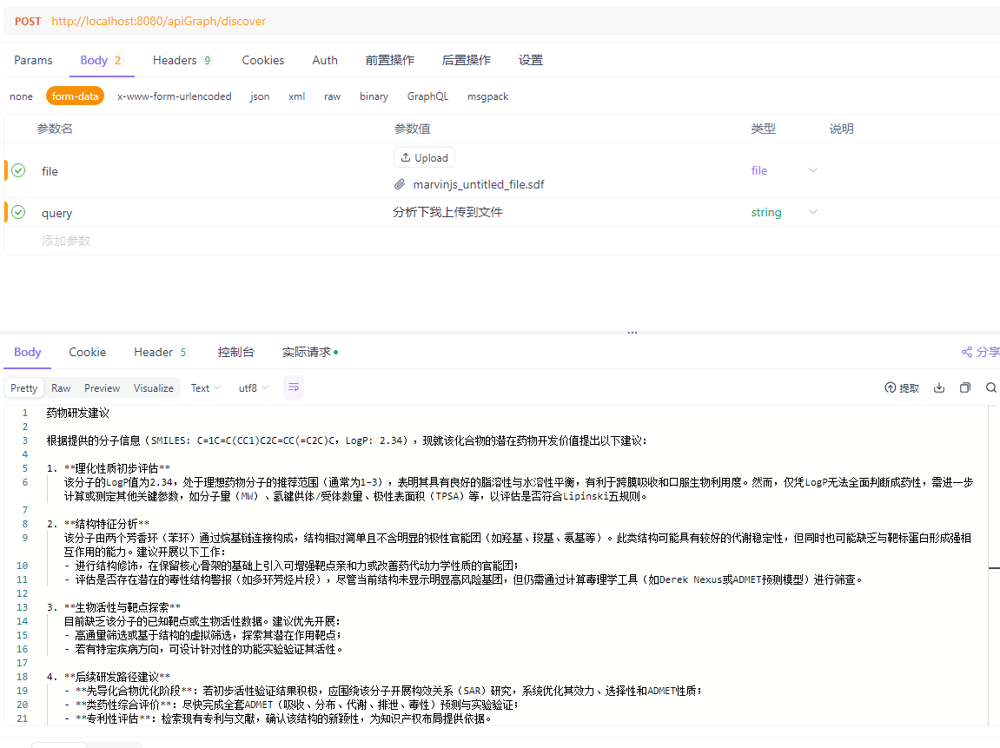

# MolGenie - 药物发现智能助手

MolGenie 是一个基于人工智能的药物发现辅助系统，利用通义千问大模型和多智能体架构，帮助研究人员设计、生成、验证和分析药物分子。

## 功能特性

- **智能分子生成**：根据自然语言描述生成候选药物分子
- **SDF文件分析**：分析用户上传的SDF格式分子数据文件
- **多智能体架构**：采用规划器、生成器、验证器和总结器四个核心智能体协同工作
- **化学信息处理**：集成CDK库进行分子结构处理和分析
- **可视化工作流**：使用PlantUML展示药物发现流程

## 技术栈

- **后端框架**：Spring Boot 3.3、Spring AI Alibaba
- **AI模型**：
- **化学信息处理**：CDK (Chemistry Development Kit)
- **构建工具**：Maven

## 系统架构

项目采用多智能体架构，包含以下核心组件：

1. **Planner Agent（规划智能体）**：分析用户请求，确定处理流程
2. **Generator Agent（生成智能体）**：生成候选药物分子
3. **Validator Agent（验证智能体）**：验证分子结构有效性
4. **Summarizer Agent（总结智能体）**：生成分析报告和建议

## API接口

### 药物发现接口

POST `/apiGraph/discover`

参数：
- `query` (可选)：用户查询文本
- `file` (可选)：SDF格式的分子文件
结果：
- 

响应：
- 返回处理结果和药物研发建议

## 部署说明

1. 确保已安装Java 17+
2. 配置DashScope API Key到 [application.yml](file://C:\Users\userz\Desktop\new\molgenie\src\main\resources\application.yml)
3. 运行命令启动服务：
   ```
   ./mvnw spring-boot:run
   ```
